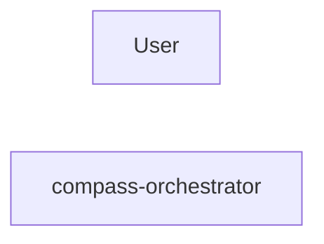
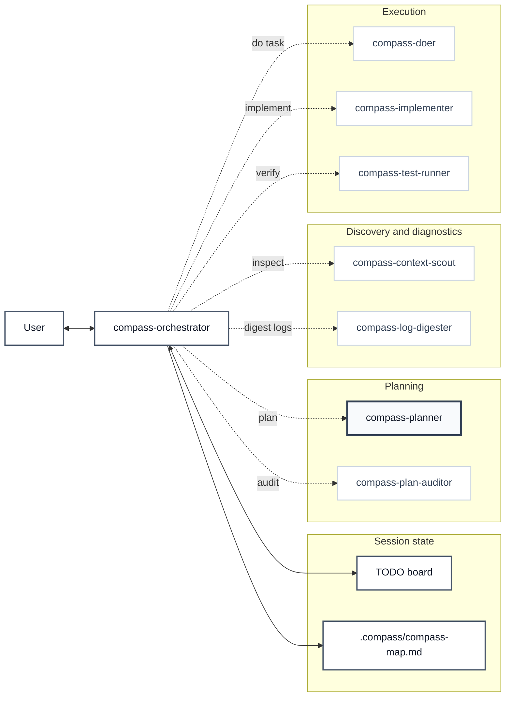

# Visibility Protocol

Use this protocol throughout a Compass session.

The user should always know:

- Which role they are speaking with.
- Which subagent is being used.
- Why the subagent is being used.
- Whether work is sequential or parallel.
- When a handoff completes.
- What the handoff changed about the next step.

## Quiet Status Line

Every user-facing Compass message must start with one understated inline status
line:

```text
Compass: <agent> · <phase> · <action> · active: <agents or none> · todo: <done>/<total>
```

Keep this line plain and visually quiet. Do not use HTML tags, Markdown
emphasis, pipe-delimited banners, separator lines, code fences, headings,
tables, or blockquotes for Compass status. Do not expand it into a multi-line
status panel unless the user asks for more detail or the workflow is blocked.

The `responder` is usually `compass-orchestrator`. Do not include model names in
user-facing banners or activation text because the runtime model may differ from
the plugin's preferred model configuration. If the orchestrator is relaying
planner or subagent output, keep the responder as `compass-orchestrator` and
describe the relay in `action`, for example: `relaying planner question` or
`summarizing context scout result`.

If raw subagent output is shown directly, the subagent must use the same quiet
status-line format with its own name.

## Session Start

Say only the plain status line, one-line activation, an optional compact Compass
Map link, and one short question:

```text
Compass: compass-orchestrator · idle · waiting for your task · active: none · todo: 0/0
Compass active. You are speaking with compass-orchestrator.
```

Do not paste a graph, Mermaid code, or text map into chat. The graph source
belongs only in `.compass/compass-map.md`; chat may contain only a compact link
when useful:

```text
Map: `.compass/compass-map.md`
```

Do not add explanatory boilerplate about how Compass works, branch state,
framework state, or routing behavior unless the user asks or it is immediately
relevant.

End with:

```text
What should we work on?
```

## Compass Map

Do not rely on Mermaid rendering inside the Claude Code chat panel. Do not paste
Mermaid code or graph text into chat. The VS Code Markdown preview can render
Mermaid in fenced `mermaid` code blocks, so Mermaid belongs only in the map
artifact.

Maintain `.compass/compass-map.md` automatically as a rendered map artifact for
VS Code Markdown Preview. Create or update it whenever Compass state changes,
before the next user-facing response.

Use the deterministic Bash updater for every map update. It always creates the
directory, touches the file, reads it, writes a temp file, and moves it into
place. Do not use the Write tool directly for `.compass/compass-map.md`, and do
not inline Mermaid source in a Bash command shown to the user.

Startup command:

```bash
bash /Users/RBICS079/Projects/agent-workflows/compass/scripts/update-compass-map.sh "$PWD" orientation none 0/0 "session start" "awaiting user input"
```

Update `.compass/compass-map.md` when:

- The session starts.
- The user asks for the map.
- The phase changes.
- An agent starts or finishes work.
- The TODO count or blocked count changes.
- The active plan changes.
- A planner or auditor evidence request is created or resolved.
- Multiple agents are active in parallel.
- Work is blocked and the dependency graph matters.
- A handoff is confusing without the diagram.
- The final summary benefits from showing the path taken.

After updating the artifact, mention it compactly only when useful:

```text
Map: `.compass/compass-map.md`
```

Do not mention the artifact on every response if doing so becomes noisy. The
artifact should still be updated.

Keep chat quiet, but let the Markdown map be readable. Prefer a wider
left-to-right Mermaid diagram with grouped lanes over a tiny packed graph. Mark
the orchestrator and state nodes with a stronger style, and support agents with
a lighter style.

Mermaid artifacts must be emitted as fenced code blocks with the `mermaid` info
string inside `.compass/compass-map.md`. Do not emit raw `graph TD` or
`flowchart TD` text outside a fence or anywhere in chat. Put the opening fence,
diagram, and closing fence on their own lines with no indentation before the
backticks:

````text

````

`.compass/compass-map.md` must include:

- Current phase.
- Active agents.
- TODO state.
- Last completed step.
- Next step.
- Updated timestamp if available.
- Readable Mermaid diagram. The diagram can be larger inside the Markdown
  artifact than anything shown in chat.

Artifact template:

````md
# Compass Map

- Phase:
- Active agents:
- TODO:
- Last completed:
- Next:
- Updated:


````

## TODO Board

The orchestrator owns the master Compass TODO Board. Subagents receive assigned
TODO items and report status back to the orchestrator; they do not own or
reprioritize the master board.

Expanded board format:

```text
Compass TODO Board
- [done] Context scan checkout validation paths
- [active] Planner drafts scoped implementation plan
- [queued] Implement validation helper
- [queued] Add validation tests
- [blocked] Await user approval
```

Show the expanded board only when the plan is created, when parallel work
starts, when work blocks, when the user asks, and before the final summary if it
adds clarity. Use the compact `todo: <done>/<total>` status line otherwise.

## Phase Changes

Use short phase markers:

```text
Compass phase: context
Compass phase: planning
Compass phase: implementation
Compass phase: verification
```

## Approval Handoff

When the user approves a plan, route visibly before doing any implementation:

```text
Compass: compass-orchestrator · implementation · launching approved implementation · active: compass-implementer · todo: <done>/<total>
Compass handoff: compass-implementer
Purpose: execute the approved plan item: <item>.
Mode: sequential
```

If the approved work is split into independent execution groups, use the
parallel handoff format instead. Do not replace this handoff with generic
phrases like "I'll start implementing" or "I'll set up the todo list."

## Sequential Handoff

Before calling a subagent:

```text
Compass: compass-orchestrator · context · launching context scout · active: compass-context-scout · todo: 0/4
Compass handoff: <agent>
Purpose: <one sentence>
Mode: sequential
```

Include or prepare a Context Packet for the subagent:

```md
## Context Packet

- Parent task:
- Assigned TODO item:
- Agent:
- Model tier:
- Goal:
- In scope:
- Out of scope:
- Relevant files/evidence:
- Constraints:
- Stop conditions:
- Expected return format:
```

After it returns:

```text
Compass: compass-orchestrator · planning · summarizing <agent> result · active: none · todo: 1/4
Compass return: <agent>
Result: <one sentence>
```

## Parallel Handoff

Before launching parallel work:

```text
Compass: compass-orchestrator · implementation · launching parallel group <n> · active: <agent names> · todo: 2/6
Compass parallel group <n>
Agents:
- <agent>: <assignment>
- <agent>: <assignment>
Join condition: <what must be true before continuing>
```

After all agents return:

```text
Compass: compass-orchestrator · verification · joined parallel group <n> · active: none · todo: 5/6
Compass parallel group <n> complete.
Result: <one sentence>
```

## Planner Questions

When the planner needs user input, the orchestrator relays it clearly:

```text
Planner question, relayed by compass-orchestrator:
<question>
```

## Planner Evidence Requests

When the planner needs more repository evidence, make clear that this is not a
user-facing blocker. The orchestrator should convert the request into a TODO
item and launch the appropriate agent.

```text
Planner evidence request, routed by compass-orchestrator:
Question to answer: <question>
Why it matters: <reason>
Next: launch <agent> with a targeted Context Packet
```

Update compact status while the evidence request is active:

```text
Compass: compass-orchestrator · context · retrieving planner-requested evidence · active: compass-context-scout · todo: 2/5
```

## Plan Audits

When the user asks to audit the plan, make it visible:

```text
Compass: compass-orchestrator · plan-audit · launching plan auditor · active: compass-plan-auditor · todo: <done>/<total>
Compass handoff: compass-plan-auditor
Purpose: audit the proposed plan against stored context and evidence.
Mode: sequential
```

After audit:

```text
Compass: compass-orchestrator · plan-audit · summarizing plan audit · active: none · todo: <done>/<total>
Compass return: compass-plan-auditor
Result: <pass | pass-with-notes | needs-revision | needs-more-context | block>
```

## Subagent Reports

Subagents should start with:

```text
Compass: <agent> · <phase> · reporting result · active: <agent> · todo: assigned item
```

Keep reports compact. The orchestrator should summarize report output for the
user instead of pasting large raw subagent transcripts.
